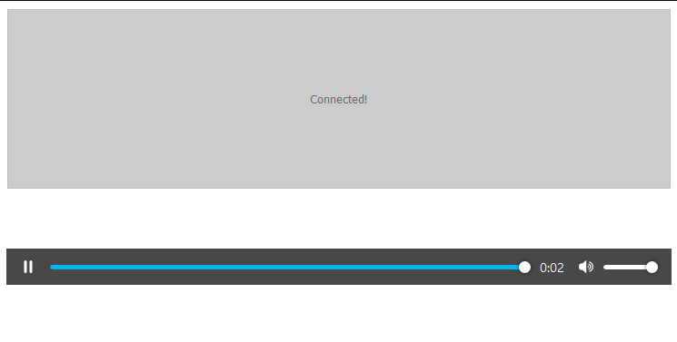

# Webpack
A basic webapp that makes use of the NodeJS version of the Spatial Audio API with Webpack. This basic webapp looks and has the same functionality as the example at [/examples/web/simple](/examples/web/simple/), except this webapp will automatically generate a JWT and pass that JWT to the client.

## Author
Zach Fox

## Usage
1. Install [NodeJS v14.15.x](https://nodejs.org/en/)
2. Run `npm install`
3. Copy `auth.example.json` to `auth.json`.
4. Populate your credentials inside `./auth.json`.
    - Obtain `HIFI_*` credentials from the [High Fidelity Spatial Audio API Developer Console](https://account.highfidelity.com/dev/account)
5. Run `npm run start`
6. If your Web browser doesn't automatically open, use a Web browser to navigate to [http://localhost:8080/](http://localhost:8080/).
