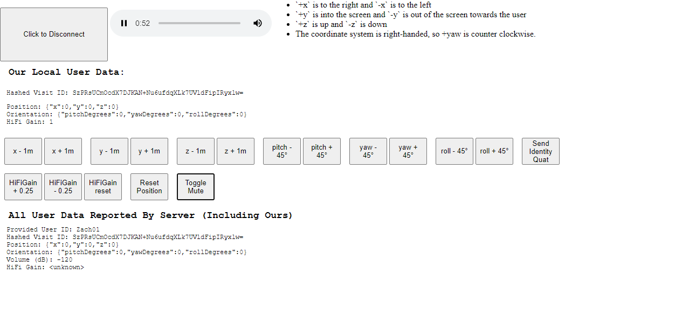

# Complex Web App Example
The example code in this directory builds a more advanced webapp than the ["Simple Web App" found here](../simple/). It adds several controls and un-skinned UI elements that allow for much finer control over users in a High Fidelity virtual space. See the screenshot below for more details.

## Author
Zach Fox
