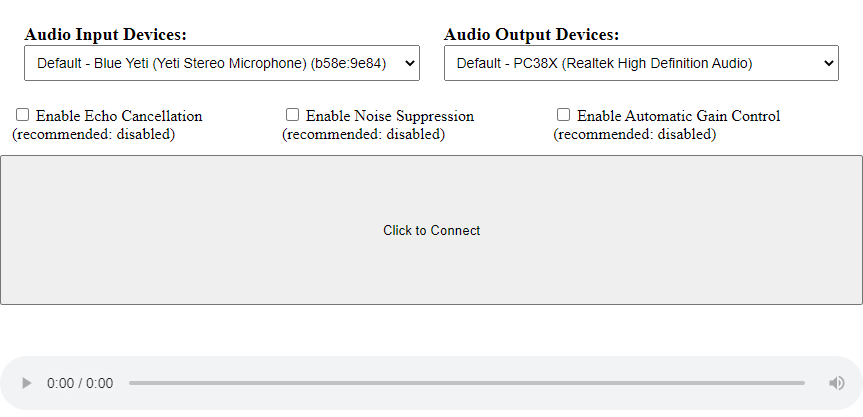

# Simple Web App Example - With Device Selection!
This heavily-commented code builds upon the ["Simple Web App Example"](../simple) by adding logic demonstrating how one may offer the user the ability to choose input and output audio devices.

Changing the value of the input or output device dropdown has an immediate effect:
- The audio stream from the newly-selected input device will be immediately sent to the High Fidelity Spatial Audio Server.
- If the user changes the selected output device, the spatialized audio stream from High Fidelity will immediately begin playing from that output device.

## Author
Zach Fox
