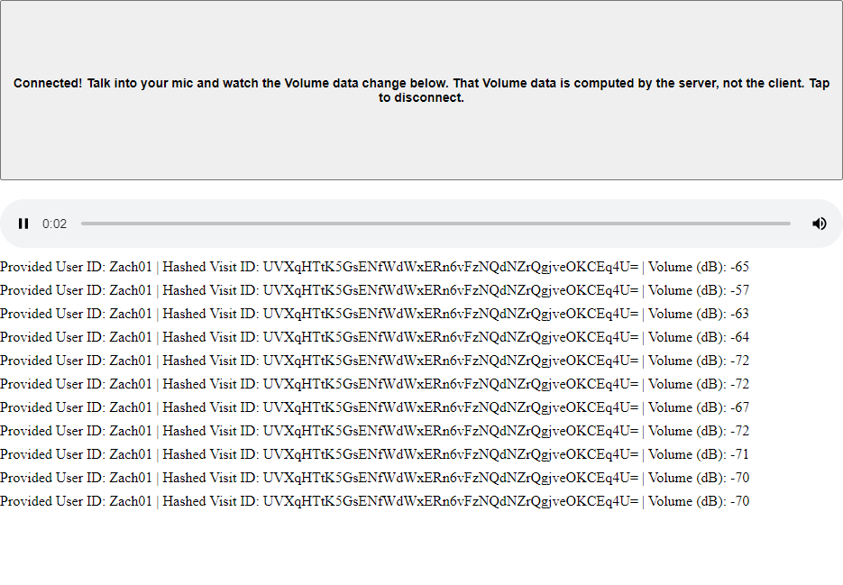

# "Subscriptions" Example
This project exemplifies how to make use of [User Data Subscriptions](https://docs.highfidelity.com/latest/modules/classes_hifiuserdatasubscription.html) in projects that use the Spatial Audio API.

Use User Data Subscriptions when you want your application to make use of data that the High Fidelity Server keeps track of, such as position data, orientation data, and volume (Decibels) data.

## Author
Zach Fox
