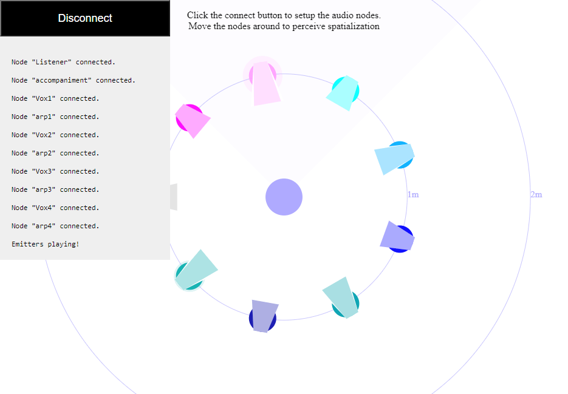

# "Tracks" Example

## Author
Luis Cuenca

## Usage
- Edit this example's code `examples/web/tracks/index.html` and add your JWT `HIFI_AUDIO_JWT`
- Set up a simple HTTP server on the root directory. I.e. Using python: `python3 -m http.server 8080`
- Visit the example in your browser: `http://localhost:8080/examples/web/tracks/index.html`
- Click the connect button. Nodes should start connecting one by one.
- The Listener node (you) should be situated on the center of the canvas.
- The Speakers (Emitters) should be situated one meter around the Listener.
- Select any node with a mouse click.
- Move the selected node with a mouse left drag.
- Rotate the selected node with a mouse right drag or click.
- Experience spatialized audio according to the scene's setup.