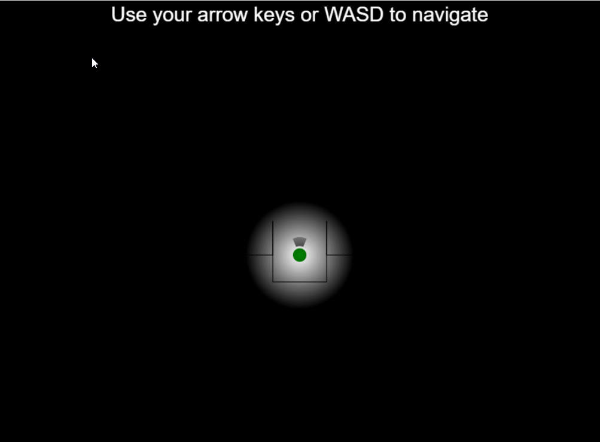

# Hifi-Spatial-API-Example-Mansion

Hifi Spatial API Example Mansion - a spooky audio environment featuring:
- The High Fidelity web spatial audio api
- The High Fidelity nodejs spatial audio api
- The High Fidelity RESTful audio environment management api

## Usage

### Setup
1. Install [NodeJS v14.15.x](https://nodejs.org/en/)
2. Install [npm](https://docs.npmjs.com/getting-started/configuring-your-local-environment)
    - MacOS: If you encounter admin priviledge errors, add `prefix=/Users/yourusername/.npm-global` to your `~/.npmrc` (or another prefix)
3. Run `npm install` in the `utils` directory
4. Run `npm install` in the `worker` directory
5. Create your space on the [High Fidelity's Spatial Audio API Developer Console](https://account.highfidelity.com/dev/account)
6. Create a JWT in that space with the username `worker`.
7. Create a JWT in that space with the username `mansion`.
7. Create an admin JWT in that space.
8. Edit `client\index.html` to set `HIFI_AUDIO_JWT` to the JWT you created for the username `mansion`.
9. Deploy the `client` directory to your webserver of choice.
    - For example, to use the node webserver, change to the `client` directory, type `npm install -g http-server`, then type `http-server`

### Install the audio environment
This installs attenuation zones for each room by using the High Fidelity RESTful audionment management api
1. Go into the `utils` directory.
2. Type `npm run update:zones -- -j <your admin JWT>`

### Run the workers
1. go into the `workers` directory.
2. Type `npm run start -- -j <your worker JWT> -n 5`

### Connect and Play
1. Go to the URL to which you deployed the `client` directory.  For example, (http://localhost:8080/)

## Author

Roxanne Skelly