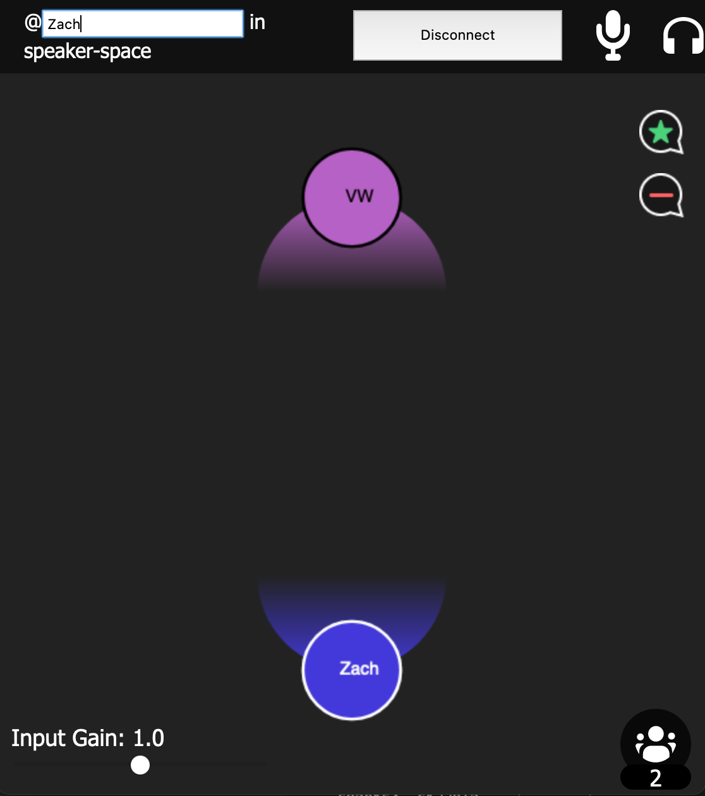

# Spatial Speaker Space
A comfortable virtual 3D audio environment for speakers and an audience that makes use of the Spatial Audio API.

This experiment makes use of most of the features offered by the Spatial Audio API, making this experiment a good candidate for understanding how the more advanced aspects of the API work.

## Author
Zach Fox

## Usage
1. Install [NodeJS v14.15.x](https://nodejs.org/en/)
2. Run `npm install`
3. Copy `auth.example.json` to `auth.json`.
4. Populate your credentials inside `./auth.json`.
    - Obtain `HIFI_*` credentials from the [Spatial Audio API Developer Console](https://account.highfidelity.com/dev/account)
5. Run `npm run start`
6. Using a Web browser, navigate to:
    - Speaker link: [localhost:8123/spatial-speaker-space/speaker](http://localhost:8123/spatial-speaker-space/speaker)
    - Audience link: [localhost:8123/spatial-speaker-space/audience](http://localhost:8123/spatial-speaker-space/audience)
