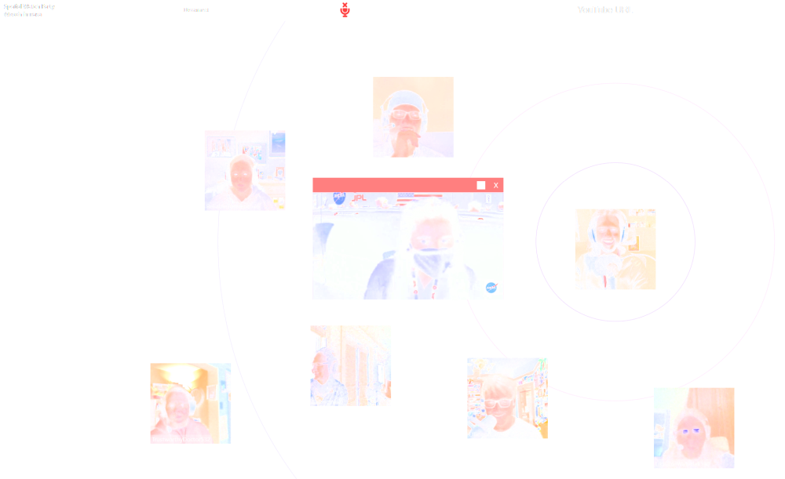

# Spatial Watch Party
A Web application that lets users watch synced YouTube videos together while chatting in a virtual 3D environment using High Fidelity's spatial audio technology.

## Author
Zach Fox

## Usage
1. Install [NodeJS v14.15.x](https://nodejs.org/en/)
2. Run `npm install`
3. Copy `auth.example.json` to `auth.json`.
4. Populate your credentials inside `./auth.json`.
    - Obtain `HIFI_*` credentials from the [High Fidelity Spatial Audio API Developer Console](https://account.highfidelity.com/dev/account)
    - Obtain `TWILIO_*` credentials from the [Twilio Console](https://www.twilio.com/console)
5. Run `npm run start`
6. Using a Web browser, navigate to [http://localhost:8085/spatial-watch-party](http://localhost:8085/spatial-watch-party)
