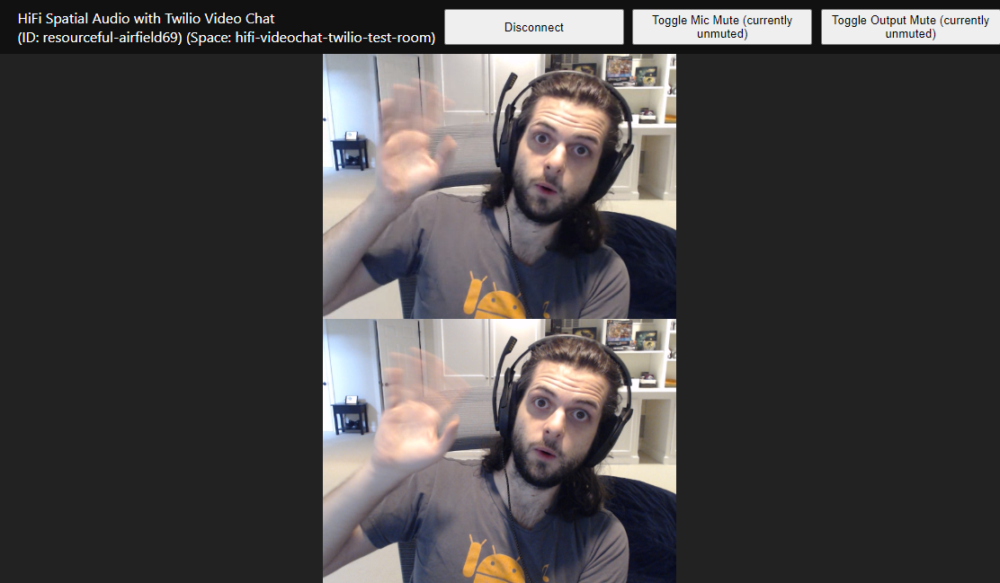

# "Street Meet" Example
Tired of staring at four walls? Let's meet somewhere cool in the street.

## Author
Luis Cuenca

## Usage
1. Install [NodeJS v14.15.x](https://nodejs.org/en/)
2. Run `npm install`
3. Copy `auth.example.json` to `auth.json`.
4. Populate your credentials inside `./auth.json`.
    - Obtain `HIFI_*` credentials from the [High Fidelity Spatial Audio API Developer Console](https://account.highfidelity.com/dev/account)
    - Obtain `TWILIO_*` credentials from the [Twilio Console](https://www.twilio.com/console)
    - Obtain `STREET_VIEW_*` credentials from the [Google Console](https://console.cloud.google.com/)
5. Run `npm run start`
6. Using a Web browser, navigate to [localhost:8587/streetMeet](http://localhost:8587/streetMeet).