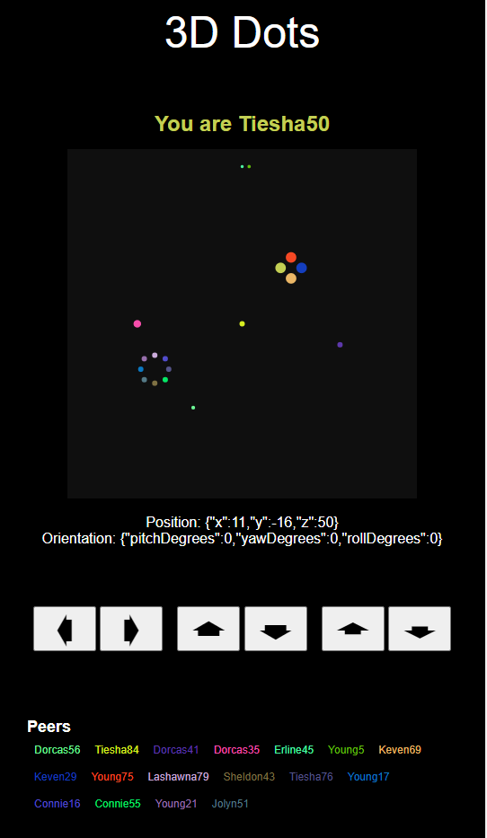

# 3D Dots
Move around as dots in a 3d space with spatial audio! You can use the 3 sets of buttons to control movement along the x, y and z axis. Movement along the z axis is depicted by the size of your dot.

## Author
Rebecca Stankus

## Notes
You will need to use your own HiFi credentials as outlined in our [guides and example apps](https://www.highfidelity.com/api/guides).

This app is based off of our example app: [Spatial Audio API, Express, and EJS](https://www.highfidelity.com/api/guides/nodejs/express). You can follow the instructions there to [set up your dev environment](https://www.highfidelity.com/api/guides/nodejs/express#setupDev) and then use the files and folder structure found in this experiment.