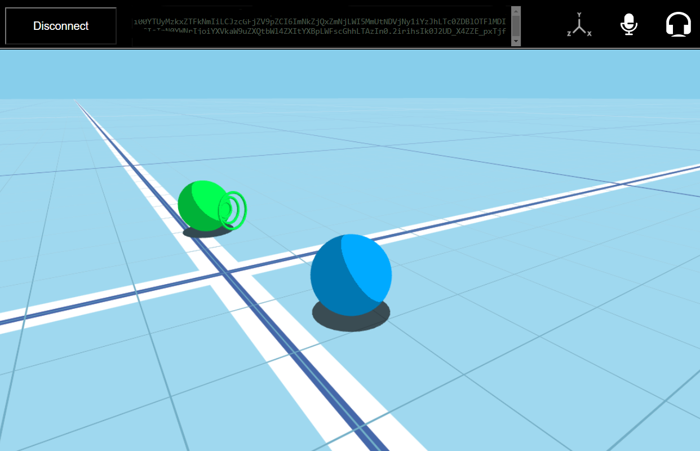

# Space Inspector

**Space Inspector** is a tool to connect into any High Fidelity Audio Space (*HifiSpace*) and inspect the state of the server
as observed from the client api. Specify a valid JWT for the HifiSpace you want to inspect and connect.
You will appear as a user *Dot* at a spawn location and from there you can navigate in the space in 3d,
interact with and observe the other users connected as broadcasted from the server.
The presentation of the state from **Space Inspector** can be trusted as the ground truth of the server state and used to debug 
and validate what is happening in a particular space.
**Space Inspector** demonstrates how to develop a simple social 3d application with THREE.js and HiFi Spatial Audio API.

## Author
Sam Gateau

## Usage

# Run the web app
 Spin a local http server on your computer (ex: `python -m http.server`) and navigate to the index.html page of the app.
- You appear as a white *dot* at the origin of the 3d space. The *dot* is a sphere of radius 0.4 meter.
- The floor grid helps appreciate the size of the space, the finer grid is 1x1 meter. 
- The camera is is 3rd person looking down at your *dot*
- You can already move in the space while disconnected

# Connect
- specify a valid 'JWT' for the HifiSpace you want to inspect.
- If needed, specify the 'hostURL' to a specific server stack url or just use the default.
- click the connnect button
- authorize the browser to use your microphone
- if successful, the communicator is connected at the position and orientation represented by your Dot, and it just changed color.
- you are now connected in the HifiSpace and can see and hear the spatialized audio of nearby users.
- all the other peers in the HifiSpace are displayed at their position and orientation.

The `jwt`, `hosturl` can be specified as parameters of the url.
For example:
`http://localhost:8000/?jwt=abcdef...xyz&spawn={x:100} 

# Navigate
Camera is moving in concert with the user *dot*, and can be experienced in 2 modes:
- First person: the Camera is exactly at the position and orientation of the User, the *dot* is NOT visible except for the drop shadow on the floor.
- Third person: the Camera is orbiting at a distance behind the user.
- Using the mouse wheel, you can snap in 1st person mode or back off in 3rd person view.

 Use the keyboard and mouse to control the camera and your *dot* movements.
- W/S or Arrow Up/Down keys control translating front or back aka the Z coordinate of the user position
- Q/E keys control straffing left or right aka the X coordinate of the user position
- Space/C keys control translating up or down aka the Y coordinate of the user position
- A/D or Arrow Left/Right control rotation left or right aka the Yaw angle of the user orientation
- Mouse move with right button down controls the orietnation of the camera and the user
-- In 1st person: Both Camera and User orietnation are the same
-- In 3rd person: Only the Yaw of the User is affected
-- Pressing Shift

# Inspect
- Select any Player with a mouse left click to display the inspector view and inspect their attributes as updated by the server.
- The color and the name of the users is assigned randomly

